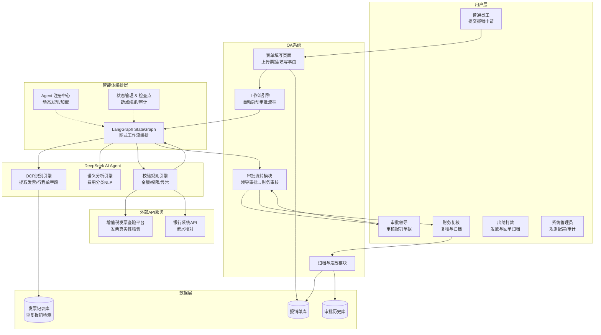
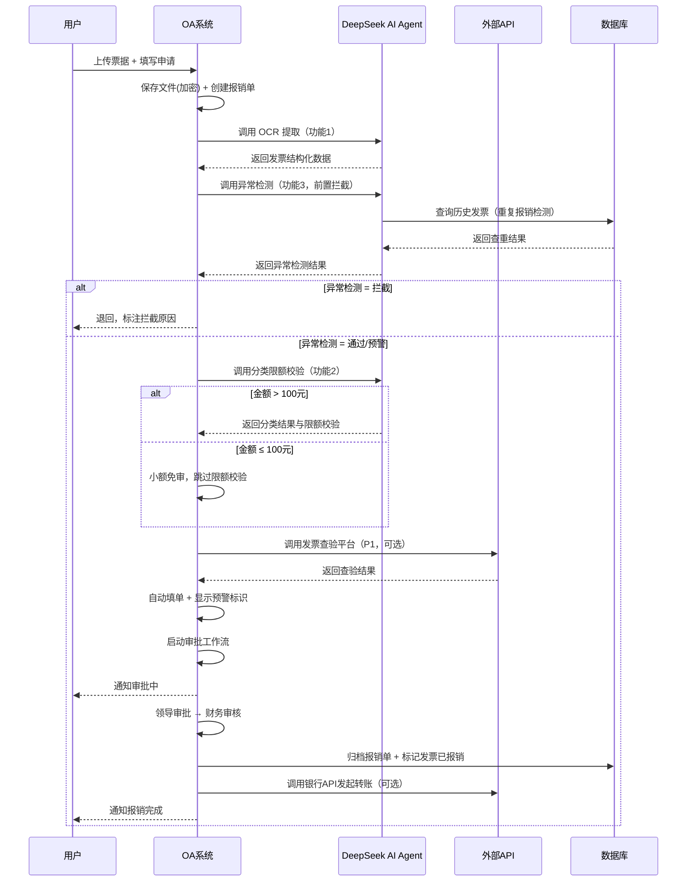
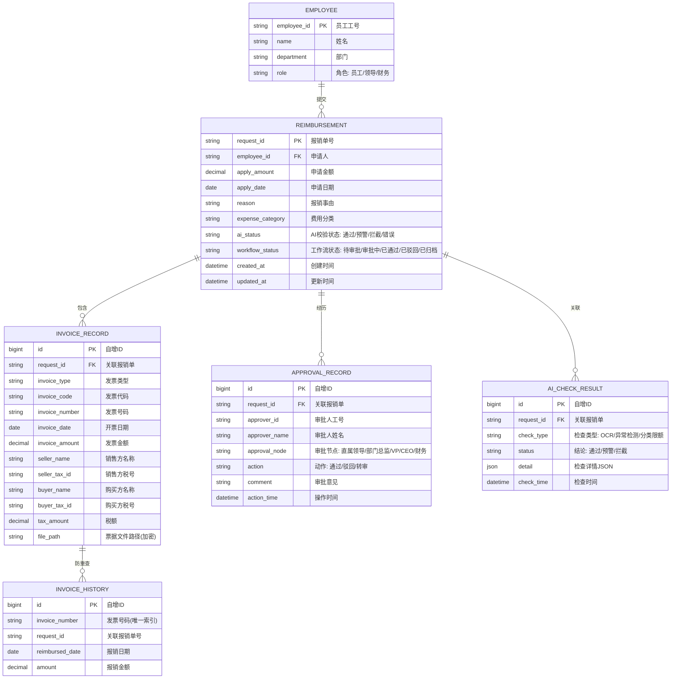
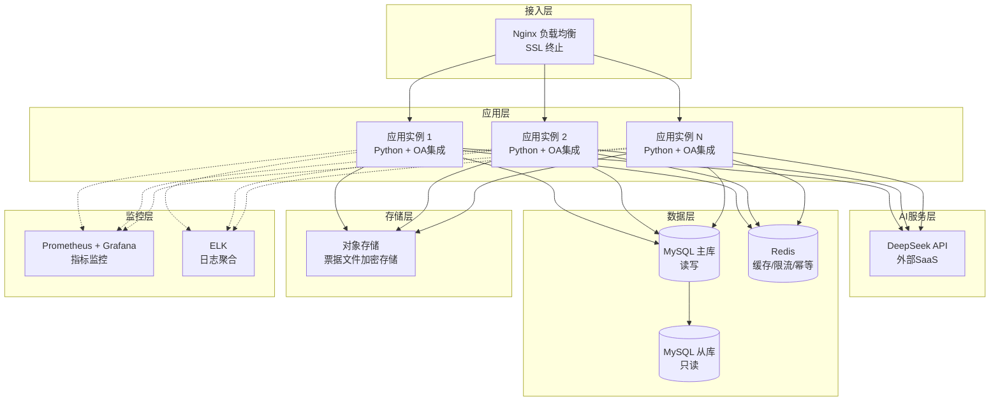
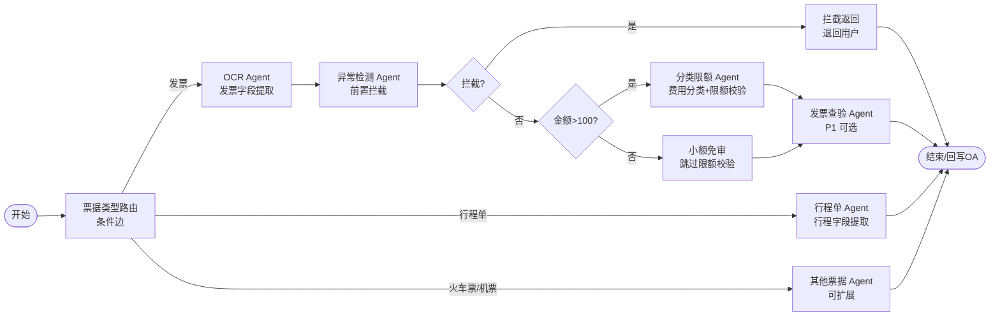

# 企业报销智能化系统 — 设计文档

## 1. 系统架构

### 1.1 目标用户角色

| 角色 | 主要操作 | 使用场景 | 操作入口 |
|------|---------|---------|---------|
| **👤 普通员工** | 上传票据 → 填写事由与金额 → 提交校验 → 等待审批结果 | 提交日常差旅、餐饮、住宿等报销 | 报销校验工作台 |
| **👔 审批领导** | 查看待审报销单 → 查看 AI 校验结果与预警 → 通过 / 驳回 / 转审 | 审核下属报销申请 | 待审工作台 |
| **💼 财务复核** | 复核 AI 校验结果 → 确认归档 | 财务复核与归档（岗 FIN-001，仅复核/归档，不可打款） | 财务复核工作台 |
| **🏦 出纳打款** | 发起费用发放 → 银行回单归档 | 打款与回单归档（岗 FIN-002，须与归档人不同人） | 出纳打款工作台 |
| **⚙️ 系统管理员** | 配置费用限额 / 异常规则 / 审批权限 → 查看审计日志 | 维护报销制度规则 | 系统配置 + 审计日志 + 用量统计工作台 |

> 5 角色权限矩阵与 `prototype.html` 角色说明面板完全对齐，各角色登录后仅可见权限范围内的 Tab（见 §17 前端架构设计）。财务职责按"四眼原则 / 职责分离"拆分为财务复核与出纳两个互斥角色，归档与打款须由不同人操作，防舞弊。

### 1.2 系统整体架构图



### 1.3 技术选型方案

| 层级 | 技术选型（目标） | 当前状态（V1.4） | 选型理由 |
|------|------------------|-------------------|---------|
| **后端语言** | Python 3.10+（目标 3.12） | ✅ 已对齐 | DeepSeek SDK 原生支持，AI 生态成熟；最低版本与 `pyproject.toml` `requires-python>=3.10` 一致 |
| **AI 引擎** | DeepSeek AI Agent（Function Call） | ✅ 已对齐 | 支持结构化 JSON 输出，OCR + NLP 一体化 |
| **智能体编排** | LangGraph（StateGraph 图式工作流） | ✅ 已对齐（V1.4 已实现，见 §16） | 开源 MIT；状态机/条件分支/并行/断点续跑/Human-in-the-loop；与现有 Function Call 架构契合度高，支撑多 AI Agent 扩展 |
| **PDF 处理** | PyMuPDF (fitz) | ✅ 已对齐 | 纯 Python，提取速度快，无需系统级依赖 |
| **OA 系统** | OA 系统（待选型） | ⚠️ 未集成（设计中） | 企业已有系统，支持 REST API 流程启动与表单填充 |
| **配置管理** | PyYAML + python-dotenv | ✅ 已对齐 | 规则与密钥分离，规则可热更新 |
| **数据库** | MySQL 8.0 | ⚠️ **SQLite**（单机开发） | 目标 MySQL：事务可靠，  OA 底层已有 MySQL 实例。当前 SQLite 仅用于 V1.4 功能验证，<br/>不支撑生产级并发与 §7.1 主从架构 |
| **缓存** | Redis | ❌ 未实现 | 目标 Redis：发票查重缓存、API 限流、幂等控制。当前代码无 Redis 依赖 |
| **消息队列** | （可选）RabbitMQ | ❌ 未实现 | 异步处理 OCR 任务，解耦 OA 与 AI Agent |
| **文件存储** | 对象存储 OSS（加密） | ⚠️ **本地 uploads/**（临时） | 目标 OSS：票据文件 AES-256 加密持久化，支持归档。当前仅本地临时存储 |

---

## 2. 核心模块设计

### 2.1 用户申请与预处理模块（阶段一）

**职责**：接收用户上传的票据与报销信息，自动启动工作流。

#### 2.1.1 用户表单设计（R1.1 / R1.2）

  企业报销申请表单字段：

| 表单字段 | 类型 | 是否必填 | 说明 |
|---------|------|---------|------|
| 报销事由 | 文本框 | ✅ | 用户填写报销事由描述 |
| 申请金额 | 数字输入 | ✅ | 用户填写的申请报销金额（元） |
| 申请日期 | 日期选择 | ✅ | 默认当天，格式 YYYY-MM-DD |
| 票据上传 | 文件上传 | ✅ | 支持 PDF / JPG / PNG，支持多文件 |
| 费用类型预选 | 下拉框 | ❌ | 差旅/餐饮/住宿/交通/办公/其他（AI 会复核） |
| 备注 | 文本框 | ❌ | 补充说明 |

#### 2.1.2 自动启动工作流（R1.3）

```
用户点击「提交」
    │
    ├──▶   OA 接收表单数据 + 票据文件
    │      │
    │      ├── 保存票据文件至对象存储 OSS（AES-256 加密）
    │      │    ⚠️ 当前 V1.4：暂存本地 uploads/，目标：迁移至 OSS 持久化归档
    │      ├── 创建报销单记录（状态：待AI校验）
    │      └── 调用 AI Agent 接口（异步）
    │
    ├──▶ AI Agent 执行三步校验（见 §2.2-2.4）
    │
    ├──▶ 校验结果回写报销单
    │      ├── 通过 / 预警 → 自动启动审批工作流
    │      └── 拦截 → 退回用户，标注拦截原因
    │
    └──▶ 工作流引擎按预设流程流转
```

### 2.2 AI 识别引擎（DeepSeek Agent）

> **执行顺序**：OCR 提取 → 异常检测（前置拦截）→ 分类限额校验
> 异常检测在分类限额**之前**执行，若拦截则直接返回，跳过后续校验。

> **编排方式演进**：
> - **历史（V1.0）**：三功能以硬编码线性串联方式实现在 `skill/agent.py` 的 `run_reimbursement_skill()` 中（见 ADR-007 背景）。
> - **当前（V1.4，已实现，见 §16）**：引入 **LangGraph** 作为智能体编排平台，将三功能重构为 `StateGraph` 节点，通过条件边实现「异常检测拦截则提前返回」的分支逻辑，并支持后续多 AI Agent 动态扩展。编排逻辑从业务代码中解耦至 `skill/orchestrator/` 层。`agent.py` 现仅作为编排入口，委托 `graph.run_graph()` 执行。

| 执行顺序 | 子模块 | 功能 | 技术方案 |
|---------|--------|------|---------|
| ① 功能1 | OCR 识别 | 提取发票类型、发票代码、发票号码、日期、金额、税号、商品明细等 | DeepSeek Function Call + 自定义 Schema |
| ② 功能3 | 异常检测 | 识别字段缺失、格式错误、重复报销、票据过期、票据即将过期、金额异常（含申请金额不足） | 规则引擎 + 历史数据比对（前置拦截） |
| ③ 功能2 | 语义分析 + 限额校验 | 识别费用类型（差旅/餐饮/住宿/交通/办公/其他），校验金额是否超限 | DeepSeek NLP + Prompt Engineering + 分类限额规则 |

### 2.3 校验规则引擎

#### 2.3.1 核心校验规则

```python
# 核心校验规则示例（完整规则见 rules/ 目录 YAML 配置）
rules = {
    # —— 金额校验 ——
    "amount_check": "invoice_amount <= apply_amount   ✅ 已实现",

    # —— 重复报销检查 ——
    "duplicate_check": "同一发票号码 30 天内不可重复报销",

    # —— 票据有效期 ——
    "expired_check": "发票开具日期距申请日不超过 180 天",

    # —— 金额异常阈值 ——
    "amount_anomaly_threshold": 10000,  # 单张发票 > 10000 元标记为金额异常

    # —— 费用分类限额 ——
    # 注：差旅限额已并入「其他」，分类为「差旅」的发票回退到「其他」限额校验
    "category_limit": {
        "餐饮": 1000,
        "住宿": 1000,
        "交通": 600,
        "办公": 200,
        "其他": 200,
        # "差旅": 合并到「其他」（限额 200），不再单列
    },

    # —— 小额免审 ——
    "small_amount_threshold": 100,  # 发票金额 <= 100 元跳过分类限额校验

    # —— 审批权限（金额阶梯审批）——
    "approval_authority": {
        "level_1": {"max_amount": 3000,   "approver": "直属领导"},
        "level_2": {"max_amount": 10000,  "approver": "部门总监"},
        "level_3": {"max_amount": 50000,  "approver": "VP/分管副总"},
        "level_4": {"max_amount": null,   "approver": "CEO"},  # 无上限
    },
}
```

#### 2.3.2 校验规则与配置文件映射

| 规则类别 | 配置文件 | 说明 |
|---------|---------|------|
| 费用分类限额 | `rules/category_limits.yaml` | 5 类限额（差旅限额并入「其他」）+ 小额免审阈值 |
| 异常检测规则 | `rules/anomaly_rules.yaml` | 票据有效期、重复报销窗口、金额异常阈值、必填字段、发票号码格式、即将过期预警阈值（剩余<30天） |
| 审批权限规则 | ✅ `rules/approval_authority.yaml` | 金额阶梯审批配置 |

### 2.4 校验结果状态机

> **统一校验状态定义**，消除需求、设计、代码间的术语不一致。

```
┌─────────────────────────────────────────────────────┐
│                  校验结果状态机                       │
├──────────┬──────────┬───────────────────────────────┤
│  状态    │  对应值   │  含义与处理动作                │
├──────────┼──────────┼───────────────────────────────┤
│  通过    │  PASS    │ 无异常，自动启动审批工作流      │
│          │          │ → 直属领导审批 → 财务审核       │
├──────────┼──────────┼───────────────────────────────┤
│  预警    │  WARNING │ 存在轻微风险（如费用超限、      │
│          │          │ 票据即将过期），提示审批人注意  │
│          │          │ → 仍启动审批工作流，附带预警标识 │
├──────────┼──────────┼───────────────────────────────┤
│  拦截    │  BLOCK   │ 存在严重异常（如字段缺失、      │
│          │          │ 重复报销、金额异常），直接退回   │
│          │          │ → 不启动审批工作流，退回用户     │
└──────────┴──────────┴───────────────────────────────┘
```

> **注意**：需求 R2.6 中的「失败」在本系统中对应状态「**拦截**」，即校验不通过导致流程中止。

> **系统错误态**：除上述三态外，当 AI 调用失败（如 OCR 提取异常、API 超时）时返回「**错误**」状态（对应代码 `CheckStatus.ERROR`），不进入审批流程，转人工录入兜底（见 §5 异常处理）。

### 2.5 流程流转模块（阶段三）

#### 2.5.1 自动填单设计（R3.1）

AI 校验通过后，系统自动将提取的字段填充至  企业报销表单：

|  表单字段 | 数据来源 | 填充规则 |
|-------------|---------|---------|
| 发票日期 | OCR 提取的 `开票日期` | 直接映射 |
| 发票金额 | OCR 提取的 `发票金额` | 直接映射 |
| 摘要 | AI 语义分析的 `费用分类` + `分类依据` | 拼接生成 |
| 费用分类 | AI 语义分析的 `费用分类` | 直接映射 |
| 发票号码 | OCR 提取的 `发票号码` | 直接映射 |
| 销售方名称 | OCR 提取的 `销售方名称` | 直接映射 |
| 税额 | OCR 提取的 `税额` | 直接映射 |

#### 2.5.2 预警标识设计（R3.2）

| 预警类型 | 标识样式 | 触发条件 |
|---------|---------|---------|
| ⚠️ 费用超限 | 橙色警告标签 | 发票金额 > 分类限额 |
| ⛔ 重复报销 | 红色拦截标签 | 同一发票号码 30 天内已报销 |
| 📅 票据过期 | 红色拦截标签 | 开票日期距申请日 > 180 天 |
| 📅 票据即将过期 | 橙色警告标签 | 票据剩余有效期 < 30 天 |
| 💰 金额异常 | 红色拦截标签 | 单张发票金额 > 10000 元 |
| 📋 字段缺失 | 红色拦截标签 | 必填字段（发票号码/日期/金额等）为空 |

预警标识在  OA 表单顶部以醒目区域展示，审批人可在审批页面查看 AI 校验详情。

#### 2.5.3 审批流转流程（R3.3）

```
                    ┌─────────────────┐
                    │  AI 校验完成     │
                    └────────┬────────┘
                             │
                    ┌────────▼────────┐
                    │  自动填单 +      │
                    │  显示预警标识     │
                    └────────┬────────┘
                             │
              ┌──────────────┼──────────────┐
              │              │              │
        ┌─────▼─────┐  ┌─────▼─────┐  ┌────▼──────┐
        │  通过      │  │  预警      │  │  拦截      │
        │  启动流程   │  │  启动流程   │  │  退回用户   │
        └─────┬─────┘  │  附带预警   │  │  标注原因   │
              │        └─────┬─────┘  └───────────┘
              │              │
              ▼              ▼
    ┌─────────────────────────────┐
    │     审批工作流引擎            │
    │  （按金额阶梯自动路由）        │
    ├─────────────────────────────┤
    │  ≤ 3000元:  直属领导 → 财务  │
    │  ≤ 10000元: 部门总监 → 财务  │
    │  ≤ 50000:   VP → 财务       │
    │  > 50000:   CEO → 财务      │
    └──────────┬──────────────────┘
               │
        ┌──────┴──────┐
        │  审批结果     │
        ├───┬───┬──────┤
        │通过│驳回│转审 │
        └─┬─┴───┴──────┘
          │
        ┌─────▼─────┐
        │  财务复核   │
        └─────┬─────┘
              │
        ┌─────▼─────┐
        │ 确认归档    │
        └─────┬─────┘
              │ (切换出纳岗 FIN-002)
        ┌─────▼─────┐
        │  出纳打款   │
        └─────┬─────┘
              │
        ┌─────▼─────┐
        │ 回单归档    │
        └───────────┘
```

**审批规则**：
- **驳回**：退回申请人修改，可附带驳回意见
- **转审**：审批人可将审批权转交给同级别或更高级别审批人
- **会签**：金额 ≥ 10000 元时，需两人会签

#### 2.5.4 数据归档与费用发放（R3.4）

> **职责分离（四眼原则）**：「确认归档」与「发起费用发放」为互斥操作，须由不同财务人员完成——财务复核岗（FIN-001）负责复核与归档，出纳岗（FIN-002）负责打款，系统强制校验「打款人 ≠ 归档人」，同一人操作将被拦截。

| 步骤 | 操作角色 | 处理逻辑 |
|------|---------|---------|
| 业务入账 / 确认归档 | 财务复核岗 FIN-001 | 报销单、发票数据、审批记录写入归档库，记录归档人，保留 ≥ 7 年（税务合规要求） |
| 发起费用发放 | 出纳岗 FIN-002 | 财务确认归档后，调用银行系统 API 发起转账；系统校验打款人 ≠ 归档人 |
| 银行回单回写归档 | 出纳岗 FIN-002 | 转账结果（银行回单）回写报销单状态，完成最终归档闭环 |
| 发票标记 | 系统 | 已报销发票号码写入历史库，防止重复报销 |

---

## 3. API 接口设计

### 3.1 DeepSeek AI Agent 接口

```http
POST /chat/completions
Content-Type: application/json
Authorization: Bearer {API_KEY}

{
  "model": "deepseek-v4-flash",
  "messages": [...],
  "tools": [INVOICE_TOOLS],
  "tool_choice": "auto",
  "temperature": 0.0
}
```

### 3.2 发票提取 Schema（Function Call）

> 已与代码实现 `invoice_schema.py` 对齐，包含发票代码、发票类型、商品明细等完整字段。

```json
{
  "发票类型": "string — 增值税专用发票/增值税普通发票/电子普通发票等",
  "发票号码": "string",
  "发票代码": "string — 发票代码（部分发票有）",
  "开票日期": "YYYY-MM-DD",
  "购买方名称": "string",
  "购买方税号": "string — 统一社会信用代码/纳税人识别号",
  "销售方名称": "string",
  "销售方税号": "string — 统一社会信用代码/纳税人识别号",
  "金额": "string — 不含税金额（合计）",
  "税率": "string — 如 6%、1%",
  "税额": "string",
  "价税合计_大写": "string — 如 壹拾肆元壹角肆分",
  "价税合计_小写": "number — 如 14.14",
  "发票金额": "number — 取自价税合计_小写，作为后续校验基准",
  "商品明细": [
    {
      "项目名称": "string",
      "规格型号": "string",
      "单位": "string",
      "数量": "string",
      "单价": "string — 不含税单价",
      "金额": "string — 该项不含税金额",
      "税率": "string",
      "税额": "string"
    }
  ]
}
```

### 3.3 行程单提取 Schema

> ✅ **已实现**：代码 `skill/schemas/itinerary_schema.py` 已实现，包含 `ITINERARY_EXTRACT_TOOL`（OCR 提取）与 `ITINERARY_VERIFY_TOOL`（合理性校验）两个 Function Call 工具。

```json
{
  "申请日期": "YYYY-MM-DD",
  "行程开始日期": "YYYY-MM-DD",
  "行程结束日期": "YYYY-MM-DD",
  "手机号": "string",
  "总行程数": "number",
  "总金额_元": "string",
  "行程详情": [{
    "序号": "number",
    "车型": "string",
    "上车时间": "YYYY-MM-DD HH:MM",
    "城市": "string",
    "起点": "string",
    "终点": "string",
    "里程_公里": "string",
    "金额_元": "string"
  }]
}
```

### 3.4 异常检测 Schema（Function Call）

> 已与代码实现 `anomaly_schema.py` 对齐。

```json
{
  "总体结论": "string — enum: [通过, 预警, 拦截]",
  "异常明细": [
    {
      "异常类型": "string — enum: [字段缺失, 格式错误, 重复报销, 票据过期, 金额异常, 日期异常]",
      "异常描述": "string — 如：发票号码缺失",
      "严重程度": "string — enum: [严重, 警告, 提示] — 严重=拦截, 警告=预警, 提示=通过但记录"
    }
  ],
  "检查摘要": "string — 本次异常检查的总结说明"
}
```

### 3.5 费用分类与限额校验 Schema（Function Call）

> 已与代码实现 `classify_schema.py` 对齐。

```json
{
  "费用分类": "string — enum: [差旅, 餐饮, 住宿, 交通, 办公, 其他]",
  "分类依据": "string — 如：发票项目名称为'住宿费'",
  "发票金额": "number",
  "分类限额": "number — 该费用分类的限额（元）",
  "是否超限": "boolean — 发票金额 > 分类限额 → true",
  "校验结果": "string — 通过则写「金额X ≤ 限额Y，通过」；超限则写「金额X > 限额Y，超出Z元，需人工审批」"
}
```

### 3.6   OA 系统接口

> 对应需求 §5 集成需求中的  OA 四项功能。

#### 3.6.1 启动报销工作流

```http
POST /api/oa/workflow/start
Content-Type: application/json
Authorization: Bearer {OA_TOKEN}

{
  "workflow_code": "REIMBURSEMENT",
  "form_data": {
    "applicant": "string — 员工工号",
    "apply_amount": "number — 申请金额",
    "apply_date": "YYYY-MM-DD",
    "reason": "string — 报销事由",
    "expense_category": "string — 费用分类",
    "invoice_number": "string — 发票号码",
    "invoice_amount": "number — 发票金额",
    "invoice_date": "YYYY-MM-DD — 开票日期",
    "ai_status": "string — 通过/预警/拦截/错误",
    "ai_warnings": ["string — 预警详情列表"]
  },
  "attachments": [
    {"file_id": "string — 票据文件ID", "file_name": "string"}
  ]
}
```

#### 3.6.2 填充报销表单字段

```http
PUT /api/oa/workflow/{request_id}/form
Content-Type: application/json

{
  "fields": {
    "invoice_date": "YYYY-MM-DD",
    "invoice_amount": "number",
    "summary": "string — AI生成的摘要",
    "expense_category": "string",
    "seller_name": "string — 销售方名称",
    "tax_amount": "string — 税额"
  }
}
```

#### 3.6.3 查询审批状态

```http
GET /api/oa/workflow/{request_id}/status

Response:
{
  "request_id": "string",
  "status": "string — 待审批/审批中/已通过/已驳回",
  "current_node": "string — 当前审批节点",
  "current_approver": "string — 当前审批人",
  "history": [
    {"node": "string", "approver": "string", "action": "string", "comment": "string", "time": "datetime"}
  ]
}
```

#### 3.6.4 数据归档

```http
POST /api/oa/workflow/{request_id}/archive
Content-Type: application/json

{
  "archive_type": "REIMBURSEMENT",
  "retain_years": 7,
  "payment_info": {
    "bank_account": "string — 收款账号（脱敏）",
    "payment_amount": "number",
    "payment_status": "string — 待发放/已发放/发放失败"
  }
}
```

### 3.7 增值税发票查验平台接口（R2.3, P1）

> 对应需求 R2.3，用于发票真实性核验。

```http
POST /api/invoice/verify
Content-Type: application/json

{
  "invoice_code": "string — 发票代码",
  "invoice_number": "string — 发票号码",
  "invoice_date": "YYYY-MM-DD — 开票日期",
  "invoice_amount": "number — 价税合计金额"
}

Response:
{
  "verify_status": "string — enum: [有效, 无效, 查无此票]",
  "verify_detail": {
    "is_consistent": "boolean — 查验信息与提交信息是否一致",
    "seller_name": "string — 销售方名称",
    "buyer_name": "string — 购买方名称",
    "amount": "number — 查验平台返回的金额"
  },
  "verify_time": "datetime"
}
```

### 3.8 银行系统 API（R2.3, P1 — 可选）

> 对应需求 R2.3，用于流水核对（可选集成）。

```http
POST /api/bank/transaction/verify
Content-Type: application/json

{
  "account_number": "string — 脱敏账号",
  "amount": "number — 交易金额",
  "date_range_start": "YYYY-MM-DD",
  "date_range_end": "YYYY-MM-DD"
}

Response:
{
  "match_status": "string — enum: [匹配, 未匹配, 多笔匹配]",
  "matched_transactions": [
    {
      "transaction_id": "string",
      "amount": "number",
      "date": "YYYY-MM-DD",
      "counterparty": "string — 交易对手（脱敏）"
    }
  ]
}
```

---

## 4. 数据流设计



---

## 5. 异常处理设计

| 异常场景 | 处理策略 | 对应状态 |
|----------|----------|---------|
| PDF 无文本（扫描件） | 提示用户，转 OCR 图片识别流程 | — |
| AI 识别失败 | 返回错误码，人工录入兜底 | 错误 |
| 外部 API 超时 | 标记为「待核验」，不影响主流程 | 预警 |
| 金额校验不通过（发票金额 > 申请金额） | 标记为「拦截」，退回用户修改 | 拦截 |
| 重复报销（同一发票号 30 天内已报销） | 标记为「拦截」，提示审批人注意 | 拦截 |
| **票据过期**（开票日期距申请日 > 180 天） | **标记为「拦截」，退回用户，提示票据已过期** | **拦截** |
| **票据即将过期**（剩余有效期 < 30 天） | 标记为「预警」，提示用户及时报销 | 预警 |
| 金额异常（单张发票 > 10000 元） | 标记为「拦截」，需人工确认 | 拦截 |
| 字段缺失（发票号码/日期/金额等为空） | 标记为「拦截」，退回用户补全 | 拦截 |
| 费用超限（发票金额 > 分类限额） | 标记为「预警」，启动审批流程，提示审批人注意 | 预警 |
| 银行转账失败 | 标记为「发放失败」，通知财务人工处理 | — |

---

## 6. 数据模型设计

### 6.1 ER 图



### 6.2 关键表结构说明

| 表名 | 用途 | 关键索引 |
|------|------|---------|
| `reimbursement` | 报销单主表 | `request_id` (PK), `employee_id` (IDX), `ai_status` (IDX) |
| `invoice_record` | 发票数据表 | `invoice_number` + `invoice_code` (UNIQUE) |
| `invoice_history` | 已报销发票历史（防重） | `invoice_number` (UNIQUE) |
| `approval_record` | 审批记录表 | `request_id` (IDX), `approver_id` (IDX) |
| `ai_check_result` | AI 校验结果表 | `request_id` (IDX) |

---

## 7. 部署架构设计

### 7.1 部署架构图



#### 7.1.1 当前实现与目标差距

> ⚠️ **当前 V1.4 实现**：`web/app.py` 以 `app.run(debug=True)` 单实例运行，无 Nginx 负载均衡、无 MySQL 主从、无 Redis、无对象存储。上述部署架构图为 **目标生产环境** 设计，当前阶段仅用于功能验证，不可直接部署生产。

| 组件 | 目标架构（§7.1） | 当前实现（V1.4） | 迁移计划 |
|------|------------------|------------------|---------|
| 应用层 | 多实例 + Nginx 负载均衡 | 单实例 `debug=True` | V2.0 切换至 Gunicorn + Nginx |
| 数据库 | MySQL 8.0 主从 | SQLite 单文件 | V2.0 迁移至 MySQL，主从同步 |
| 缓存 | Redis 哨兵模式 | 未实现 | V2.0 引入 Redis（查重缓存/限流/幂等） |
| 存储 | 对象存储 OSS 多副本 | 本地 `uploads/` 临时目录 | V2.0 对接 OSS，AES-256 加密 |
| 消息队列 | RabbitMQ | 未实现 | V2.1 按需引入（异步 OCR） |

### 7.2 容灾方案

| 组件 | 容灾策略 | RTO | RPO |
|------|---------|-----|-----|
| 应用实例 | 多实例部署，Nginx 健康检查自动剔除故障节点 | < 30s | 0 |
| MySQL | 主从复制，主库故障自动切换从库 | < 5min | < 1min |
| Redis | 哨兵模式，自动故障转移 | < 1min | < 1s |
| DeepSeek API | 多 API Key 轮询，单 Key 限流时自动切换 | < 10s | 0 |
| 对象存储 | 多副本存储，跨可用区冗余 | < 1min | 0 |

---

## 8. 非功能特性保障方案

### 8.1 性能保障（N1：响应时间 ≤ 10 秒）

| 措施 | 说明 |
|------|------|
| DeepSeek API 超时控制 | `REQUEST_TIMEOUT = 120s`，单次 OCR 调用超时 30s 后降级 |
| 异步处理 | OA 提交后异步调用 AI Agent，用户无需等待 |
| Redis 缓存 | 发票查重结果缓存，避免重复查询数据库 |
| 批量处理优化 | 多张发票并行 OCR，单批 ≤ 5 张 |

### 8.2 准确率保障（N2：提取准确率 ≥ 95%）

| 措施 | 说明 |
|------|------|
| Function Call 结构化输出 | 强制 JSON Schema 约束，减少自由文本误差 |
| `temperature = 0.0` | 确定性输出，消除随机性 |
| 必填字段校验 | `invoice_schema.py` required 字段强制校验 |
| 人工复核兜底 | AI 识别失败时标记「错误」，转人工录入 |
| Prompt 持续优化 | 根据误识别样本迭代 Prompt，建立测试集回归验证 |

### 8.3 可用性保障（N3：系统可用性 ≥ 99.5%）

| 措施 | 说明 |
|------|------|
| 多实例部署 | 应用层 ≥ 2 实例，Nginx 负载均衡 + 健康检查 |
| 数据库主从 | MySQL 主从复制，自动故障转移 |
| 降级策略 | DeepSeek API 不可用时，OA 侧降级为人工录入模式 |
| 重试机制 | 外部 API 调用失败自动重试 3 次，指数退避 |
| 监控告警 | Prometheus 监控关键指标，异常自动告警 |

### 8.4 安全性保障（N4：数据加密）

| 措施 | 说明 |
|------|------|
| API Key 管理 | 通过 `.env` 环境变量管理，不硬编码 |
| 传输加密 | 全链路 HTTPS，TLS 1.2+ |
| 存储加密 | 票据文件 AES-256 加密存储，访问需授权 |
| 数据脱敏 | 手机号、银行账号等敏感字段脱敏展示 |
| 审计日志 | 全操作日志记录，支持审计追溯 |
| 权限控制 | 基于角色的访问控制（RBAC），员工/领导/财务权限隔离 |

### 8.5 扩展性保障（N5：支持新增票据类型）

| 措施 | 说明 |
|------|------|
| 插件化 Schema | 每种票据类型独立 Schema 文件（如 `itinerary_schema.py`），新增类型只需新增文件 |
| 配置驱动规则 | 费用分类限额、异常规则均通过 YAML 配置，无需改代码 |
| 模块化工具 | OCR 提取、异常检测、分类限额三个 Tool 独立，可按票据类型组合 |
| **LangGraph 图式编排** | 每个 Agent 作为 StateGraph 节点，新增票据类型只需注册新 Agent 节点 + 添加边，无需改核心代码（见 §16） |
| **Agent 注册中心** | 统一注册/发现机制，票据类型路由由条件边驱动，支持动态加载新 Agent |
| **并行编排能力** | 多票据类型可映射为并行节点，支撑批量处理优化（§8.1） |
| 演进路线 | 火车票 → 机票 → 出租车票 → 餐饮小票，逐步新增 Schema |

---

## 9. 架构风险与演进建议

### 9.1 架构风险

| 风险 | 影响 | 缓解措施 |
|------|------|---------|
| DeepSeek API 限流/不可用 | OCR 功能中断 | 多 Key 轮询 + 降级人工录入 + 本地 OCR 备选 |
|   OA API 版本变更 | 集成接口失效 | 接口适配层封装，版本兼容处理 |
| 发票查重误判（号码重复） | 正常报销被拦截 | 增加发票代码+号码联合判断，提供人工申诉通道 |
| 票据为扫描件（无文本层） | OCR 提取失败 | 转 DeepSeek 视觉模型识别，或提示用户上传电子发票 |
| ~~行程单 Schema 未实现~~ | ~~行程单无法自动提取~~ | ✅ 已实现（V1.1），见 §9.2 |

### 9.2 演进路线

| 阶段 | 内容 | 优先级 |
|------|------|--------|
| **V1.0** | 发票 OCR + 异常检测 + 分类限额 +   OA 集成 | ✅ 已实现 |
| **V1.1** | 行程单 Schema 实现 + 行程单 OCR 提取 + 行程单异常检测 + 合理性校验 | ✅ 已实现 |
| **V1.2** | 增值税发票查验平台对接 + 银行流水核对 | P1（待实现） |
| **V1.3** | 审批权限规则落地（金额阶梯审批，`rules/approval_authority.yaml` + `tool_approval_routing.py`） | ✅ 已实现 |
| **V1.4（当前）** | 引入 LangGraph 编排层，三功能重构为 StateGraph 节点；抽象 Agent 注册机制（见 §16、ADR-007/008） | ✅ 已实现 |
| **V2.0** | 火车票/机票 Schema + 多票据类型支持（多 Agent 并行编排） | P2 |
| **V2.1** | 数据分析仪表盘（报销趋势、异常统计） | P2 |
| **V3.0** | 智能审批建议（AI 基于历史数据推荐通过/驳回，多 Agent 协作） | P3 |

---

## 10. 架构决策记录（ADR）

> 根据 `constitution.md` §4.1 要求，重大架构决策须以 ADR 记录。完整 ADR 存放于 `docs/adr/` 目录。

---

## 11. 身份认证与授权架构

### 11.1 认证方案

```
用户 ──▶   OA 登录页面
           │
           ├──▶ OA 内置认证（LDAP/AD 域控）
           │      └──▶ 校验企业域账号密码
           │
           ├──▶ 返回 OA Session Token
           │      │
           │      └──▶ AI Agent 接口调用时携带 Token
           │
           └──▶ AI Agent 验证 Token 有效性
                  └──▶ 调用 OA /api/auth/verify 校验
```

| 认证环节 | 方案 | 说明 |
|---------|------|------|
| 用户登录 |   OA 内置 LDAP/AD 认证 | 复用企业已有域控，无需额外账号体系 |
| AI Agent 接口 | Bearer Token 校验 | 每次请求携带 OA Session Token，调用 OA `/api/auth/verify` 校验有效性 |
| API Key 管理 | `.env` + Vault（目标） | 当前 `.env` 管理，目标迁移至 HashiCorp Vault 或云 KMS 统一密钥管理 |

### 11.2 授权模型（RBAC）

| 角色 | 权限范围 | 数据权限 |
|------|---------|---------|
| **普通员工** | 提交报销；查看自身报销单；修改被驳回申请 | 仅查看本人数据 |
| **审批领导** | 查看待审列表；通过/驳回/转审；查看下属报销记录 | 查看所辖部门数据 |
| **财务复核** | 复核 AI 校验结果；确认归档（记录归档人） | 查看全部报销数据（脱敏） |
| **出纳打款** | 发起费用发放（须与归档人不同人）；银行回单回写归档 | 查看全部报销数据（脱敏） |
| **系统管理员** | 规则配置（YAML）；用户角色管理；审计日志查看 | 全部数据（含审计日志） |

### 11.3 权限隔离实现

```
┌─────────────────────────────────────────────┐
│                  API 层                       │
│  @require_role("employee")                   │
│  @require_role("approver")                   │
│  @require_role("finance")                    │
│  @require_role("admin")                      │
├─────────────────────────────────────────────┤
│              权限校验中间件                    │
│  1. 提取 Bearer Token                        │
│  2. 调用 OA /api/auth/verify 校验身份         │
│  3. 获取用户角色 + 所属部门                    │
│  4. 注入 request.user 上下文                  │
├─────────────────────────────────────────────┤
│              数据权限过滤                      │
│  - 员工：WHERE employee_id = current_user     │
│  - 领导：WHERE department = current_dept      │
│  - 财务/管理员：无过滤（脱敏展示）              │
└─────────────────────────────────────────────┘
```

---

## 12. 集成架构设计

### 12.1 集成模式

| 集成关系 | 模式 | 协议 | 说明 |
|---------|------|------|------|
|   OA → AI Agent | 同步 HTTP | REST + JSON | OA 提交报销时同步调用 AI 校验（超时 30s） |
| AI Agent → DeepSeek | 同步 HTTP | REST + JSON | Function Call 调用（超时 120s） |
| AI Agent → 发票查验平台 | 异步（可选） | REST + JSON | 非关键路径，异步回调结果 |
|   OA → 银行系统 | 异步 | REST + JSON | 财务确认后触发，结果回写 |
|   OA → AI Agent（流程流转）| 事件驱动 | Webhook 回调 | OA 审批节点流转时通知 AI Agent |

### 12.2 API 版本管理

所有 AI Agent 对外接口统一前缀 `/api/v1/`，版本升级策略：

| 版本策略 | 说明 |
|---------|------|
| URL 路径版本 | `/api/v1/reimbursement/check`、`/api/v2/...` |
| 向后兼容 | 旧版本至少保留 2 个大版本周期（约 6 个月） |
| 废弃通知 | 通过响应头 `Deprecation: true` + `Sunset: <date>` 提前通知 |
| 变更日志 | `CHANGELOG.md` 记录每个版本的接口变更 |

### 12.3 限流策略

| 限流对象 | 阈值 | 时间窗口 | 实现方式 |
|---------|------|---------|---------|
| DeepSeek API | 60 RPM | 1 分钟 | Token Bucket（API Key 级别） |
| AI Agent 对外接口 | 100 RPM | 1 分钟 | 滑动窗口限流（Redis） |
| 发票查验平台 | 10 RPM | 1 分钟 | Token Bucket（P1 对接时启用） |
| 单用户上传 | 10 次 | 1 分钟 | 用户级别限流，防滥用 |

```python
# 限流响应格式
{
  "error": "RATE_LIMITED",
  "message": "请求过于频繁，请稍后重试",
  "retry_after": 30  # 秒
}
```

### 12.4 熔断降级

```
                    ┌─────────────┐
                    │  调用外部API  │
                    └──────┬──────┘
                           │
                    ┌──────▼──────┐
                    │  熔断器状态   │
                    └──┬───┬───┬──┘
           ┌───────────┤   │   ├───────────┐
     [关闭 Closed]     │   │   [开启 Open]   │
     正常调用          │   │   直接降级      │
           │           │   │            │
     失败计数累计       │   │    等待冷却时间  │
     达到阈值 ─────▶   │   │   (30s)      │
           │           │   │            │
           │      [半开 Half-Open]      │
           │       尝试恢复调用         │
           │       成功→关闭           │
           │       失败→开启           │
```

| 熔断配置 | 阈值 | 说明 |
|---------|------|------|
| 失败阈值 | 5 次/30s | 滑动窗口内连续失败 ≥ 5 次触发熔断 |
| 冷却时间 | 30s | 熔断后 30s 进入半开状态 |
| 半开探测 | 1 次成功恢复 | 半开状态下一次调用成功则关闭熔断器 |
| 降级策略 | 标记「待核验」+ 人工兜底 | 不阻塞主流程，确保可用性 ≥ 99.5% |

### 12.5 幂等性设计

| 场景 | 幂等键 | 实现方式 |
|------|--------|---------|
| OA 提交报销 | `request_id`（OA 生成） | 数据库 UNIQUE 约束，重复提交返回已有结果 |
| AI 校验回写 | `request_id` + `check_type` | `ai_check_result` 表 UNIQUE(request_id, check_type) |
| OA Webhook 回调 | `event_id` | 由 OA 生成唯一事件 ID，数据库去重 |
| 银行转账 | `request_id` | 银行接口幂等键，防重复打款 |

---

## 13. 运维监控架构

### 13.1 监控指标体系

#### 业务指标（N2 准确率 ≥ 95%）

| 指标名称 | 计算方式 | 目标值 | 告警阈值 |
|---------|---------|--------|---------|
| OCR 字段提取准确率 | `正确字段数 / 总字段数` | ≥ 95% | < 90% P1 告警 |
| 费用分类准确率 | `正确分类数 / 总分类数` | ≥ 95% | < 90% P1 告警 |
| 异常检测拦截准确率 | `正确拦截数 / 总拦截数` | ≥ 90% | < 80% P1 告警 |
| 误拦截率 | `误拦截数 / 总拦截数` | ≤ 5% | > 10% P1 告警 |
| 平均处理时长 | `Σ(校验完成时间 - 提交时间) / 总数` | ≤ 10s | > 15s P2 告警 |

#### 技术指标（N3 可用性 ≥ 99.5%）

| 指标名称 | 说明 | 目标值 | 告警阈值 |
|---------|------|--------|---------|
| API QPS | 每秒请求数 | — | 超过容量 80% |
| API 延迟 P50/P95/P99 | 接口响应时间分位数 | P99 ≤ 5s | P99 > 10s P2 告警 |
| API 错误率 | 5xx 错误 / 总请求 | ≤ 0.1% | > 1% P1 告警 |
| DeepSeek API 可用率 | 成功调用 / 总调用 | ≥ 99.5% | < 99% P1 告警 |
| DeepSeek API 延迟 | 单次调用耗时 | ≤ 30s | > 60s 启用降级 |
| 系统可用性 | `(总时间 - 不可用时间) / 总时间` | ≥ 99.5% | < 99.5% P0 告警 |

### 13.2 告警体系

| 告警级别 | 定义 | 通知渠道 | 响应时间 | 示例 |
|---------|------|---------|---------|------|
| **P0 紧急** | 系统核心功能不可用 | 电话 + 企业微信 + 短信 | 5 分钟内 | 服务宕机、数据库不可用、DeepSeek 全 Key 限流 |
| **P1 严重** | 功能降级但不影响主流程 | 企业微信 + 邮件 | 15 分钟内 | AI 准确率低于阈值、错误率飙高 |
| **P2 警告** | 性能下降或潜在风险 | 企业微信群通知 | 1 小时内 | 延迟升高、磁盘使用率 > 80% |
| **P3 提示** | 运维关注 | 邮件日报 | 次日 | 证书即将过期、存储容量预警 |

### 13.3 链路追踪

> 当前 `structured_log.py` 已实现 `request_id` 全链路传递，目标升级至 OpenTelemetry。

```
┌──────────┐    ┌──────────┐    ┌──────────┐    ┌──────────┐
│    OA  │───▶│ AI Agent │───▶│ DeepSeek │───▶│  数据库   │
│ request_id│    │ span_id  │    │ span_id  │    │ span_id   │
└──────────┘    └──────────┘    └──────────┘    └──────────┘
        │              │               │               │
        └──────────────┴───────────────┴───────────────┘
                        │
                  ┌─────▼─────┐
                  │  Jaeger    │
                  │  分布式追踪 │
                  └───────────┘
```

| 组件 | 当前方案（V1.4） | 目标方案（V2.0） |
|------|-----------------|-----------------|
| Trace ID | `request_id`（`structured_log.py`） | OpenTelemetry Trace ID |
| 日志聚合 | 本地文件 | ELK（Elasticsearch + Logstash + Kibana） |
| 指标收集 | 无 | Prometheus + Grafana |
| 分布式追踪 | 无 | OpenTelemetry + Jaeger |

### 13.4 日志规范

| 级别 | 使用场景 | 示例 |
|------|---------|------|
| **ERROR** | 异常需立即处理：AI 调用失败、数据库异常 | `ERROR | request_id=xxx | DeepSeek API timeout after 30s` |
| **WARNING** | 潜在问题：限流触发、金额超限、字段缺失 | `WARNING | request_id=xxx | Amount ¥15,000 exceeds category limit ¥500` |
| **INFO** | 关键业务节点：提交、校验完成、审批流转 | `INFO | request_id=xxx | Reimbursement check completed, status=PASS` |
| **DEBUG** | 开发调试：Schema 解析细节、规则匹配过程 | `DEBUG | Schema matched: invoice_schema, fields=12` |

**关键要求**：
- 所有日志必须包含 `request_id` 用于全链路追踪
- 敏感字段（手机号、银行账号）脱敏后写入（如 `138****1234`）
- 审计日志（用户操作、配置变更）单独写入 `audit_log` 表，不可删除

### 13.5 CI/CD 流水线

```
代码提交 ──▶ 代码检查 ──▶ 单元测试 ──▶ 构建镜像 ──▶ 部署 Staging ──▶ 集成测试 ──▶ 部署生产
   │           │           │           │              │              │
   GitHub    flake8 +   pytest       Docker      K8s Staging    E2E 测试     K8s Prod
              mypy      覆盖率≥80%   镜像构建    环境验证        通过         灰度发布
```

| 阶段 | 工具 | 说明 |
|------|------|------|
| 代码检查 | flake8 + mypy | 代码风格 + 类型检查 |
| 单元测试 | pytest | 覆盖率 ≥ 80%（`constitution.md` §5） |
| 构建 | Docker | 统一构建环境，Python 3.12 基础镜像 |
| 部署 | Kubernetes | 滚动更新，灰度发布，自动回滚 |

---

## 14. OA 适配器层设计

> 根据 `constitution.md` §2.4 要求：OA 集成通过适配器模式封装，切换 OA 系统时变更范围最小化。

### 14.1 适配器接口抽象

```python
from abc import ABC, abstractmethod
from dataclasses import dataclass
from typing import Optional


@dataclass
class OAWorkflowRequest:
    """统一的 OA 工作流请求模型"""
    workflow_code: str            # 工作流编码
    form_data: dict               # 表单数据
    attachments: list[dict]       # 附件列表
    applicant_id: str             # 申请人


@dataclass
class OAWorkflowResponse:
    """统一的 OA 工作流响应模型"""
    request_id: str               # 工作流实例 ID
    status: str                   # started / failed
    error_msg: Optional[str]


@dataclass
class OAApprovalResult:
    """统一的审批结果模型"""
    request_id: str
    status: str                   # 待审批 / 审批中 / 已通过 / 已驳回
    current_node: str
    current_approver: str
    history: list[dict]


class OAAdapter(ABC):
    """OA 系统适配器抽象接口 — 切换 OA 系统只需实现此接口"""

    @abstractmethod
    async def start_workflow(self, req: OAWorkflowRequest) -> OAWorkflowResponse:
        """启动报销工作流"""
        ...

    @abstractmethod
    async def fill_form(self, request_id: str, fields: dict) -> bool:
        """填充表单字段（AI 识别结果回填）"""
        ...

    @abstractmethod
    async def query_status(self, request_id: str) -> OAApprovalResult:
        """查询审批状态"""
        ...

    @abstractmethod
    async def archive(self, request_id: str, archive_data: dict) -> bool:
        """数据归档"""
        ...

    @abstractmethod
    async def verify_token(self, token: str) -> Optional[dict]:
        """校验认证 Token，返回用户信息"""
        ...


class DefaultOAAdapter(OAAdapter):
    """默认 OA 系统适配器实现"""
    # 实现上述接口，封装  OA REST API 调用
    pass


class FeishuAdapter(OAAdapter):
    """飞书审批适配器实现（未来可能的 OA 系统）"""
    pass
```

### 14.2 适配器工厂

```python
# config/oa.yaml — 配置驱动，切换 OA 系统只需修改配置
oa:
  provider: "default"             # default / feishu / dingtalk
  default:
    base_url: "${OA_BASE_URL}"
    api_key: "${OA_API_KEY}"
    timeout: 30
  retry:
    max_attempts: 3
    backoff: "exponential"


# skill/adapter/oa_factory.py
def create_oa_adapter() -> OAAdapter:
    config = load_oa_config()
    if config.provider == "default":
        return DefaultOAAdapter(config)
    elif config.provider == "feishu":
        return FeishuAdapter(config)
    raise ValueError(f"Unsupported OA provider: {config.provider}")
```

### 14.3 适配器与 AI Agent 解耦

```
┌──────────────────────────────────────────┐
│               AI Agent (核心)              │
│   OCR 提取 → 异常检测 → 分类限额校验        │
│                │                          │
│                │ 通过 OAAdapter 接口调用    │
│                ▼                          │
│    ┌────────────────────────┐             │
│    │  OA 适配器层 (接口抽象)  │             │
│    │  ├─ 启动工作流           │             │
│    │  ├─ 填充表单             │             │
│    │  ├─ 查询状态             │             │
│    │  ├─ 归档                │             │
│    │  └─ 认证校验             │             │
│    └────────┬───────────────┘             │
│             │                              │
│    ┌────────▼───────────────┐             │
│    │   OA 系统适配器      │             │
│    │ (唯一耦合 OA 细节的地方)  │             │
│    └────────────────────────┘             │
└──────────────────────────────────────────┘
```

---

## 15. 数据分类分级与合规映射

### 15.1 数据分级

| 级别 | 定义 | 示例数据 | 处理要求 |
|------|------|---------|---------|
| **绝密** | 泄露导致严重损害 | 系统根密钥、加密主密钥 | KMS 管理，禁止日志打印，双人授权访问 |
| **机密** | 泄露导致重大损害 | 银行账号、完整手机号、身份证号 | AES-256 加密存储，脱敏展示，访问审计 |
| **内部** | 泄露导致轻微损害 | 员工姓名、部门、报销金额、票据内容 | 权限管控，操作留痕 |
| **公开** | 可对外 | 费用分类规则、公告通知 | 无需特殊保护 |

### 15.2 敏感数据脱敏规则

| 字段 | 脱敏规则 | 示例 |
|------|---------|------|
| 手机号 | 前 3 后 4 保留，中间 4 位 `****` | `138****1234` |
| 银行账号 | 仅保留后 4 位 | `**** **** **** 7890` |
| 身份证号 | 仅保留前 3 后 4 位 | `310****1234` |
| 税号 | 完整展示（企业信息，非个人隐私） | `91310000MA1XXXXXX` |
| API Key | 日志中脱敏为 `****` | `sk-****` |

### 15.3 合规要求映射

| 法规/标准 | 条款 | 系统映射 | 实现 |
|----------|------|---------|------|
| **《税务会计法》** | 报销凭证保留 ≥ 7 年 | §2.5.4 归档模块，`retain_years: 7` | `archive` 表 + OSS 冷存储 |
| **《个人信息保护法》** | 最小必要原则 + 脱敏 | §15.1 数据分级 + §15.2 脱敏规则 | 仅收集报销必要的 12 字段 |
| **《网络安全法》** | 等级保护 | §7 部署架构 + §11 认证授权 | 三级等保对标（应用层+数据层安全） |
| **《数据安全法》** | 数据分类分级 | §15.1 数据分级 | 四级分类（绝密/机密/内部/公开） |
| **企业内控** | 金额阶梯审批 | §2.3.1 `approval_authority` | 3000/10000/50000 三级阈值 |

### 15.4 数据生命周期

```
┌─────────┐    ┌─────────┐    ┌─────────────┐    ┌─────────┐
│ 数据产生  │───▶│ 活跃使用  │───▶│ 归档（7年）  │───▶│  销毁    │
│ 票据上传  │    │ 审批流转  │    │ 只读冷存储    │    │ 安全擦除  │
└─────────┘    └─────────┘    └─────────────┘    └─────────┘
     │              │                │                 │
     ▼              ▼                ▼                 ▼
 AES-256加密    RBAC管控        OSS低频存储      覆盖写×3次
 传输TLS 1.2   操作审计日志     不可篡改标记      审计记录销毁
```

| 阶段 | 持续时长 | 存储介质 | 访问控制 |
|------|---------|---------|---------|
| 活跃 | 审批期间（通常 1-7 天） | MySQL 热数据 | 按角色权限读写 |
| 归档 | 审批完成至 7 年 | OSS 低频存储（冷数据） | 只读，需审计审批 |
| 销毁 | 7 年期满后 | — | NIST 800-88 安全擦除，记录销毁日志 |

---

## 16. 智能体编排平台设计（LangGraph）

> 对应 ADR-007 / ADR-008（已采纳）。引入开源智能体编排平台 **LangGraph**，将原硬编码线性串联重构为图式工作流，支撑多 AI Agent 动态扩展、并行编排、断点续跑与审计追溯。**V1.4 已实现**：`skill/orchestrator/` 编排层（`graph.py` / `state.py` / `registry.py` / `nodes/`）、`skill/agents/` Agent 抽象层均已落地。

### 16.1 设计目标

| 目标 | 说明 |
|------|------|
| 编排与业务解耦 | 编排逻辑从 `agent.py` 迁移至独立 `orchestrator/` 层，业务 Agent 只关注自身逻辑 |
| 多 Agent 动态扩展 | 新增票据类型只需注册新 Agent 节点，不修改编排核心代码（开闭原则） |
| 条件分支与并行 | 异常检测拦截则提前返回；多票据类型可并行编排 |
| 状态持久化与断点续跑 | 内置 checkpointer，长流程中断可恢复，满足审计追溯 |
| Human-in-the-loop | 支持人工复核节点介入（如金额异常需人工确认） |

### 16.2 编排架构图



### 16.3 全局状态定义（StateGraph State）

> LangGraph 通过 `TypedDict` 定义全局共享状态，节点间传参由框架自动管理，消除手工传递易错问题。

```python
# skill/orchestrator/state.py
from typing import TypedDict, Optional, Any
from enum import Enum


class CheckStatus(str, Enum):
    """校验状态枚举（与原 agent.py 返回的 status 字符串保持一致）"""
    PASS = "通过"
    WARNING = "预警"
    BLOCK = "拦截"
    ERROR = "错误"


class ReimbursementState(TypedDict, total=False):
    """报销校验工作流全局状态。

    所有字段可选（``total=False``），由各节点按需写入并合并。
    """

    # —— 输入 ——
    request_id: str                       # 报销单号（全链路追踪；为空则不持久化）
    pdf_path: str                         # 票据文件路径
    apply_amount: Optional[float]         # 申请金额
    apply_date: str                       # 申请日期 YYYY-MM-DD
    employee_id: str                      # 员工工号
    reason: str                           # 报销事由
    expense_category: str                 # 费用分类预选
    ticket_type: str                      # 票据类型：发票/行程单/火车票/机票

    # —— 节点产出（Agent 间共享）——
    ocr_result: Optional[dict[str, Any]]            # OCR 提取的结构化票据数据
    anomaly_result: Optional[dict[str, Any]]        # 异常检测结果
    classify_result: Optional[dict[str, Any]]       # 分类限额校验结果
    verify_result: Optional[dict[str, Any]]         # 发票查验结果（P1 占位）
    itinerary_result: Optional[dict[str, Any]]      # 行程单合理性校验结果

    # —— 流程控制 ——
    final_status: CheckStatus             # 最终校验状态
    summary: str                          # 总结说明（出口直接使用）
    warnings: list[str]                   # 预警明细
    block_reason: Optional[str]           # 拦截原因
    errors: list[str]                     # 异常错误
    history: list[dict[str, Any]]         # 节点执行历史（审计）
```

### 16.4 工作流定义（StateGraph）

```python
# skill/orchestrator/graph.py
from __future__ import annotations

from typing import Any

from langgraph.graph import END, StateGraph

try:  # langgraph 新版（>=0.2）提供 START 常量，入口点改用 add_conditional_edges
    from langgraph.graph import START
    _HAS_START = True
except ImportError:  # 旧版无 START，回退到 set_conditional_entry_point
    START = None  # type: ignore[assignment]
    _HAS_START = False

from ..config import SMALL_AMOUNT_THRESHOLD
from .nodes.anomaly_node import anomaly_node
from .nodes.classify_node import classify_node
from .nodes.itinerary_node import itinerary_node
from .nodes.ocr_node import ocr_node
from .nodes.skip_node import skip_node
from .nodes.verify_node import verify_node
from .state import CheckStatus, ReimbursementState


def route_by_ticket_type(state: ReimbursementState) -> str:
    """条件边：按票据类型路由到对应 Agent"""
    return state.get("ticket_type", "发票")


def route_after_ocr(state: ReimbursementState) -> str:
    """条件边：OCR 失败则提前结束"""
    if state.get("final_status") == CheckStatus.ERROR:
        return "error"
    return "ok"


def route_after_anomaly(state: ReimbursementState) -> str:
    """条件边：异常检测后路由（与 §16.2 架构图一致）

    - 拦截 → 提前结束
    - 通过且金额 > 100 → 分类限额校验
    - 通过且金额 ≤ 100 → 小额免审
    """
    if state.get("final_status") == CheckStatus.BLOCK:
        return "block"
    invoice_amount = (state.get("ocr_result") or {}).get("发票金额", 0)
    if isinstance(invoice_amount, (int, float)) and invoice_amount > SMALL_AMOUNT_THRESHOLD:
        return "classify"
    return "skip"


def build_reimbursement_graph():
    """构建报销校验工作流并编译"""
    workflow: StateGraph = StateGraph(ReimbursementState)

    # —— 注册节点 ——
    workflow.add_node("ocr", ocr_node)
    workflow.add_node("anomaly", anomaly_node)
    workflow.add_node("classify", classify_node)
    workflow.add_node("skip", skip_node)
    workflow.add_node("itinerary", itinerary_node)
    workflow.add_node("verify", verify_node)

    # —— 设置入口：按票据类型路由 ——
    _ticket_routing = {
        "发票": "ocr",
        "行程单": "itinerary",
        # 新增票据类型只需在此扩展路由 + 注册新节点
    }
    if _HAS_START:
        # langgraph 新版：用 add_conditional_edges(START, ...)
        workflow.add_conditional_edges(START, route_by_ticket_type, _ticket_routing)
    else:
        # langgraph 旧版：set_conditional_entry_point
        workflow.set_conditional_entry_point(route_by_ticket_type, _ticket_routing)

    # —— 发票分支边 ——
    # OCR 失败→END / 成功→anomaly
    workflow.add_conditional_edges(
        "ocr",
        route_after_ocr,
        {"error": END, "ok": "anomaly"},
    )
    # 异常检测后：拦截→END / 金额>100→classify / 小额免审→skip
    workflow.add_conditional_edges(
        "anomaly",
        route_after_anomaly,
        {
            "block": END,
            "classify": "classify",
            "skip": "skip",
        },
    )
    workflow.add_edge("classify", "verify")
    workflow.add_edge("skip", "verify")
    workflow.add_edge("verify", END)

    # —— 行程单分支直接结束 ——
    workflow.add_edge("itinerary", END)

    return workflow.compile()


def run_graph(initial_state: dict[str, Any]) -> dict[str, Any]:
    """构建并执行报销校验工作流，返回最终状态"""
    app = build_reimbursement_graph()
    return app.invoke(initial_state)
```

### 16.5 Agent 注册中心设计

> 对应 ADR-008。通过装饰器注册 + 基类约束，实现 Agent 插件化扩展。

```python
# skill/agents/base_agent.py
from abc import ABC, abstractmethod
from dataclasses import dataclass
from typing import Any


@dataclass
class AgentMeta:
    name: str                  # Agent 唯一标识
    ticket_type: str           # 支持的票据类型
    description: str           # 功能描述
    input_schema: type         # 入参 Schema
    output_schema: type        # 出参 Schema


class BaseAgent(ABC):
    """Agent 抽象基类 — 所有 Agent 必须继承并实现 run"""

    @abstractmethod
    def meta(self) -> AgentMeta:
        ...

    @abstractmethod
    async def run(self, state: dict) -> dict:
        """执行 Agent 逻辑，返回状态更新"""
        ...


# skill/orchestrator/registry.py
_AGENT_REGISTRY: dict[str, BaseAgent] = {}


def register_agent(agent: BaseAgent) -> BaseAgent:
    """注册 Agent 到注册中心"""
    info = agent.meta()
    if info.name in _AGENT_REGISTRY:
        raise ValueError(f"Agent 已注册: {info.name}")
    _AGENT_REGISTRY[info.name] = agent
    return agent


def get_agent(name: str) -> BaseAgent:
    """按名称获取 Agent"""
    if name not in _AGENT_REGISTRY:
        raise KeyError(f"未注册的 Agent: {name}，已注册: {list(_AGENT_REGISTRY)}")
    return _AGENT_REGISTRY[name]


def list_agents() -> list[AgentMeta]:
    """列出所有已注册 Agent 元信息"""
    return [a.meta() for a in _AGENT_REGISTRY.values()]
```

**新增票据类型示例**（无需修改编排核心代码）：

```python
# skill/agents/itinerary_agent.py
from .base_agent import BaseAgent, AgentMeta
from ..orchestrator.registry import register_agent
from ..schemas.itinerary_schema import ItinerarySchema


@register_agent
class ItineraryAgent(BaseAgent):
    def meta(self) -> AgentMeta:
        return AgentMeta(
            name="itinerary",
            ticket_type="行程单",
            description="行程单 OCR 提取与校验",
            input_schema=ItinerarySchema,
            output_schema=ItinerarySchema,
        )

    async def run(self, state: dict) -> dict:
        # 行程单提取与校验逻辑
        ...
        return {"ocr_result": result, "final_status": "通过"}
```

### 16.6 目录结构调整

```
skill/
├── orchestrator/              # 新增：智能体编排层
│   ├── graph.py               # LangGraph 工作流定义
│   ├── state.py               # 全局状态定义（TypedDict）
│   ├── registry.py            # Agent 注册中心
│   └── nodes/                 # Graph 节点（封装 Agent 调用）
│       ├── ocr_node.py
│       ├── anomaly_node.py
│       ├── classify_node.py
│       ├── itinerary_node.py  # 新增 Agent 节点
│       └── verify_node.py     # 发票查验节点（P1）
├── agents/                    # 新增：独立 Agent 定义
│   ├── base_agent.py          # Agent 抽象基类
│   ├── invoice_agent.py       # 发票 Agent
│   ├── itinerary_agent.py     # 行程单 Agent
│   └── ...                    # 未来：火车票/机票 Agent
├── tools/                     # 保留：原子工具（DeepSeek Function Call）
├── schemas/                   # 保留：票据 Schema 定义
├── rules/                     # 保留：YAML 规则配置
└── agent.py                   # 重构：仅作为编排入口，调用 graph
```

### 16.7 迁移计划与阶段目标

| 阶段 | 内容 | 目标 |
|------|------|------|
| **V1.4（P0）✅** | 引入 LangGraph，将现有三功能重构为 StateGraph 节点；抽象 Agent 注册中心 | ✅ 已完成：功能等价重构，编排逻辑解耦 |
| **V1.5（P1）✅** | 行程单 Agent 注册上线；条件边支持票据类型路由 | ✅ 已完成：行程单 Agent 已通过 `itinerary_node` 接入 StateGraph |
| **V2.0（P1）** | 火车票/机票 Agent；多票据并行编排；checkpointer 状态持久化 | 多 Agent 并行 + 断点续跑 |
| **V3.0（P2）** | 智能审批建议 Agent（多 Agent 协作 + Human-in-the-loop） | 多 Agent 对话协作 |

### 16.8 与现有架构的兼容性

| 现有资产 | 迁移处理 |
|---------|---------|
| `skill/tools/` 原子工具（OCR/异常/分类 Function Call） | ✅ **保留**，封装为 Graph 节点内部调用 |
| `skill/schemas/` Schema 定义 | ✅ **保留**，作为 Agent 输入/输出契约 |
| `skill/rules/` YAML 规则配置 | ✅ **保留**，规则引擎逻辑不变 |
| `skill/agent.py` `run_reimbursement_skill()` | ✅ **已重构**为编排入口，委托 `graph.py` 执行 |
| `web/app.py` 调用入口 | ✅ **不变**，仍调用 `run_reimbursement_skill()`，内部透明切换至 LangGraph |

### 16.9 前端流水线可视化

> 对应需求 R3.5（P1 ✅ 已实现）。

前端在校验提交后展示 LangGraph 节点逐步执行的动画，包含：
- **节点名称**：票据类型路由 → OCR → 异常检测 → 分类限额/小额免审 → 发票查验
- **调用工具**：每个节点调用的 DeepSeek Function Call 工具名称
- **执行详情**：节点输入/输出摘要、耗时、状态（进行中/完成/拦截）

可视化通过 `web/templates/result.html` + `web/static/upload.js` 实现，向后端轮询节点执行状态并渲染进度动画。

---

## 17. 前端架构设计（多角色工作台）

> 对齐 `prototype.html` V1.5 双智能体协同·多角色工作台原型。前端按 5 角色路由独立工作台，权限隔离，共享双智能体校验能力；财务职责拆分为「财务复核」与「出纳打款」两个互斥角色，落实职责分离。

### 17.1 整体结构

```
登录页（5 角色下拉选择）
    │
    ├──▶ 普通员工    → 报销校验工作台
    ├──▶ 审批领导    → 待审工作台
    ├──▶ 财务复核    → 财务复核工作台（复核/归档）
    ├──▶ 出纳打款    → 出纳打款工作台（打款/回单归档）
    └──▶ 系统管理员  → 系统配置 + 审计日志 + 用量统计（3 Tab）
```

### 17.2 角色与 Tab 路由映射

| 角色 | 可见 Tab | 默认进入 |
|------|---------|---------|
| 普通员工 | 📋 报销校验 | 报销校验 |
| 审批领导 | 📥 待审工作台 | 待审工作台 |
| 财务复核 | 💼 财务复核 | 财务复核 |
| 出纳打款 | 🏦 出纳打款 | 出纳打款 |
| 系统管理员 | ⚙️ 系统配置 / 📜 审计日志 / 📊 用量统计 | 系统配置 |

> Tab 路由由 JS `ROLE_TABS` 配置驱动，新增角色只需扩展配置，不改路由逻辑。

### 17.3 角色权限说明面板

登录后主区域顶部提供折叠式 `<details>` 面板，展示 5 角色权限矩阵（与需求文档 §2 一致）：

| 角色 | 主要操作 | 使用场景 |
|------|---------|---------|
| 👤 普通员工 | 上传票据 → 填写事由与金额 → 提交校验 → 等待审批结果 | 提交日常差旅、餐饮、住宿等报销 |
| 👔 审批领导 | 查看待审报销单 → 查看 AI 校验结果与预警 → 通过/驳回/转审 | 审核下属报销申请 |
| 💼 财务复核 | 复核 AI 校验结果 → 确认归档 | 财务复核与归档（岗 FIN-001） |
| 🏦 出纳打款 | 发起费用发放 → 银行回单归档 | 打款与回单归档（岗 FIN-002，须与归档人不同人） |
| ⚙️ 系统管理员 | 配置费用限额/异常规则/审批权限 → 查看审计日志 | 维护报销制度规则 |

### 17.4 各工作台设计

#### 17.4.1 报销校验工作台（普通员工）

保留 V1.4 票据上传 + AI 校验流水线可视化（§16.9），新增：
- 票据类型切换（发票 / 行程单），切换时联动上传区域样式与默认金额
- 校验结果卡片：OCR 结果、异常检测、分类限额、行程合理性校验
- 操作按钮：通过→「提交审批」，预警/拦截→「人工审核」

#### 17.4.2 待审工作台（审批领导）

| 元素 | 说明 |
|------|------|
| 统计栏 | 待审数量 + 本月已审数量 |
| 待审列表 | 报销单卡片：单号、事由、金额、提交人、提交时间、费用类型 |
| AI 校验摘要 | 每条卡片展示 AI 校验结论与预警（✓ 通过 / ⚠️ 预警 / ⛔ 拦截） |
| 状态标签 | 票据类型（发票/行程单）+ AI 状态 + 审批状态（待审） |
| 操作按钮 | 📄 查看明细 / ↪️ 转审 / ✕ 驳回 / ✓ 通过 |

#### 17.4.3 财务复核工作台（财务复核岗 FIN-001）

| 元素 | 说明 |
|------|------|
| 统计栏 | 待复核 + 待归档数量 |
| 复核列表 | 已审批通过的报销单，含审批人信息，仅显示未归档单据 |
| AI 复核摘要 | 复核 AI 校验结果作为参考 |
| 操作按钮 | 📄 查看明细 / 📦 确认归档（**不可打款**） |
| 职责约束 | 本岗仅复核/归档；打款需切换出纳岗操作 |

#### 17.4.4 出纳打款工作台（出纳岗 FIN-002）

| 元素 | 说明 |
|------|------|
| 统计栏 | 待打款 + 本月已打款数量 |
| 打款列表 | 已由财务复核岗归档的报销单，展示归档人工号 |
| AI 复核摘要 | 复核 AI 校验结果作为参考 |
| 操作按钮 | 📄 查看明细 / 💰 发起打款 |
| 职责约束 | 系统强制校验「打款人 ≠ 归档人」，同一人操作将被拦截；打款成功后自动回写银行回单并归档 |

#### 17.4.5 系统配置工作台（系统管理员）

| 配置类别 | 配置项 |
|---------|--------|
| 💰 费用限额 | 交通月度限额、住宿月度限额、餐饮月度限额、行程单单笔阈值 |
| 🚨 异常检测规则 | 重复报销、金额异常、发票真伪、行程单字段完整性、DeepSeek 语义复核（开关） |
| 👥 审批权限 | ≤3000元直属领导 / ≤10000元部门总监 / ≤50000元VP·分管副总 / >50000元CEO / 金额 ≥ 10000 元 需两人会签（在对应级别基础上增加一位审批人）（开关） |

#### 17.4.6 审计日志工作台（系统管理员）

见 §19 审计日志模块设计。

#### 17.4.7 用量统计工作台（系统管理员）

见 §18 用量统计模块设计。

### 17.5 前端技术选型

| 项 | 选型 | 说明 |
|----|------|------|
| 实现方式 | 原生 HTML + CSS + JS（原型阶段） | `prototype.html` 单文件演示；生产环境迁移至 `web/templates/` + `web/static/` |
| 设计令牌 | CSS 变量（`--primary` / `--green` / `--purple` 等） | 统一色彩体系，发票=绿色系，行程单=紫色系 |
| 响应式 | `@media (max-width: 600px)` | 移动端适配 |
| 角色路由 | JS `ROLE_TABS` 配置驱动 | 新增角色只需扩展配置，不改路由逻辑 |

---

## 18. 用量统计模块设计

> 对应需求 R4.1-R4.4。系统管理员可查看 DeepSeek API 用量统计与费用预估。

### 18.1 定价模型

| 项 | 单价 |
|----|------|
| 输入 tokens | ¥0.001 / 1K tokens |
| 输出 tokens | ¥0.002 / 1K tokens |

**费用公式**：`费用(CNY) = 输入量 ÷ 1000 × 0.001 + 输出量 ÷ 1000 × 0.002`

### 18.2 概览指标卡

| 指标 | 说明 |
|------|------|
| 总调用次数 | 成功 + 失败计数 |
| Token 总量 | 输入 + 输出，支持 K/M 格式化 |
| 预估费用 (CNY) | 按定价模型计算 |
| 平均延迟 | 单位秒，附成功率 |

### 18.3 每日趋势柱状图

- 时间范围：近 7 天
- 柱高 = 当日 Token 消耗量
- 柱顶数字 = 当日调用次数
- 悬停 Tooltip：日期 + 调用次数 + Token 量

### 18.4 分类统计占比条

按调用类型统计 Token 占比、调用次数、输入/输出 Token、费用：

| 调用类型 | 说明 |
|---------|------|
| 发票OCR提取 | 发票智能体 OCR 调用 |
| 行程单OCR提取 | 行程单智能体 OCR 调用 |
| 异常检测 | 规则引擎 + DeepSeek 语义检查 |
| 分类限额 | 费用分类与限额校验 |
| Vision API | 票据图片识别（复用 `deepseek-v4-flash` 多模态能力） |

### 18.5 明细记录表

支持三重筛选：日期 / 调用类型 / 状态。字段包括：时间、Request ID、调用类型、模型、输入Token、输出Token、总Token、延迟、状态、费用。

---

## 19. 审计日志模块设计

> 对应需求 R4.5。记录全链路操作日志，支持合规审查与事后追溯。

### 19.1 审计日志范围

| 操作类别 | 记录内容 |
|---------|---------|
| 用户操作 | 提交报销、审批通过/驳回/转审、归档、打款 |
| 登录认证 | 登录成功、登录失败 |
| 系统配置 | 费用限额更新、异常规则开关、审批权限授予 |
| AI 校验 | AI 校验执行（关联用量统计） |

### 19.2 审计日志字段

| 字段 | 说明 |
|------|------|
| 时间 | 操作时间戳 |
| 操作人 | 用户姓名 |
| 角色 | 普通员工/审批领导/财务复核/出纳打款/系统管理员 |
| 操作类型 | 提交/审批通过/审批驳回/转审/归档/发起打款/登录/配置更新/规则切换/权限授予 |
| 对象 | 操作目标（报销单号 + 金额 / 配置项 / 工号） |
| 结果 | 成功 / 失败 |
| IP | 操作来源 IP |

### 19.3 操作类型标签

| 操作码 | 标签 |
|--------|------|
| SUBMIT | 📤 提交报销 |
| APPROVE | ✓ 审批通过 |
| REJECT | ✕ 审批驳回 |
| TRANSFER | ↪️ 转审 |
| ARCHIVE | 📦 归档 |
| PAYMENT_INIT | 💰 发起打款 |
| RECEIPT_ARCHIVE | 🏦 回单归档 |
| LOGIN | 🔓 登录 |
| LOGIN_FAILED | ⚠️ 登录失败 |
| CONFIG_UPDATE | ⚙️ 配置更新 |
| RULE_TOGGLE | 🚦 规则切换 |
| PERMISSION_GRANT | 👥 权限授予 |

### 19.4 审计日志存储

- **存储方式**：独立 `audit_log` 表，不可删除（仅追加）
- **保留期限**：≥ 7 年（税务合规要求，同 §15.4 数据生命周期）
- **访问权限**：仅系统管理员可查看全量日志；其他角色仅可查看自身操作记录

---

## 20. 文档版本信息

| 版本 | 日期 | 变更人 | 变更说明 |
|------|------|--------|---------|
| V1.0 | 2025-07-13 | — | 初始版本：系统架构 + 核心模块 + API 接口 + 数据模型 |
| V1.1 | 2025-07-13 | EA 架构评审 | 修复 P0：ER 图关系修正（一对一 → 一对多）；<br/>新增 P0：技术选型当前状态标注 + 部署差距说明；<br/>新增 P1-P2：ADR / 认证授权 / 集成架构 / 运维监控 / OA 适配器 / 数据分级合规 / 文档版本信息 |
| V1.2 | 2026-07-13 | EA 架构评审 | 新增 P0：§16 智能体编排平台设计（LangGraph），含架构图/状态定义/工作流定义/Agent 注册中心/目录结构/迁移计划；<br/>新增 ADR-007（LangGraph 编排平台选型）、ADR-008（Agent 注册中心设计）；<br/>更新 §1.2 架构图新增编排层、§1.3 技术选型新增编排层级、§2.2 编排方式演进说明、§8.5 扩展性措施、§9.2 演进路线新增 V1.4 阶段 |
| V1.3 | 2026-07-13 | 代码同步评审 | 修复文档与代码不一致：§1.3 LangGraph 状态由「未实现」更正为「已对齐」；§2.2 编排方式演进更正为当前 V1.4 已实现；§2.3.1 修正餐饮/交通限额值与 `category_limits.yaml` 一致；§3.3 行程单 Schema 由「待实现」更正为「已实现」；§7.1.1 版本标识由 V0.x 更正为 V1.4；§9.2 演进路线 V1.1/V1.3/V1.4 状态更正为已实现；§10.1 ADR-007/008 状态由「待评审」更正为「已采纳」；§16.3 状态定义补齐 `CheckStatus.ERROR` 与 `itinerary_result`/`summary` 等字段；§16/§16.7/§16.8 标注 LangGraph 编排层已落地 |
| V1.4 | 2026-07-13 | 文档一致性修复 | §1.1 补充系统管理员角色；§1.3 Python 版本标注最低 3.10+（目标 3.12）；§2.2/§2.3.2/§2.5.2/§5 补充票据即将过期与申请金额不足检测项；§2.4 补充系统错误态（ERROR）说明；§2.5.3 会签阈值统一为 ≥50000；§16.9 新增前端流水线可视化设计；项目名称统一为 企业报销智能化系统 |
| V1.5 | 2026-07-13 | 文档一致性修复（续） | §1.2 架构图补充系统管理员角色；§1.3/§14 移除 OA 厂商名称 ；§2.4 标题更正为四态；§3.6.1/§6.1 ai_status 补充错误态；§8.5 交叉引用修正（§17→§16）；§9.1 行程单风险标记已解决；§9.2 V2.0 重复条目修正为 V2.1 |
| V1.6 | 2026-07-14 | 对齐原型多角色工作台 | §1.1 角色表补充「主要操作」与「使用场景」列（对齐 `prototype.html` 4 角色权限矩阵）；新增 §17 前端架构设计（多角色工作台/Tab 路由/角色说明面板）；新增 §18 用量统计模块设计（DeepSeek 定价/Token 计费/趋势图表/明细筛选）；新增 §19 审计日志模块设计（操作类型/全链路追溯）；原 §17 文档版本信息顺延为 §20 |
| V1.7 | 2026-07-20 | 财务职责分离（防舞弊） | §1.1 / §1.2 将「财务人员」拆为「财务复核」「出纳打款」两个互斥角色（5 角色）；§2.5.3 流程图拆分归档与打款；§2.5.4 数据归档与费用发放补充职责分离与银行回单回写归档；§11.2 RBAC 拆分财务权限；§17 前端架构改为 5 角色、财务复核/出纳两个 Tab 与两个工作台；§17.4.3-17.4.4 拆分财务工作台；§19.2-19.3 审计角色与操作类型（RECEIPT_ARCHIVE）同步；对齐 `prototype.html` V1.5 防舞弊改造 |
| V1.7 | 2026-07-19 | 审批阶梯对齐 README | 审批路由阈值统一为 3000/10000/50000，会签阈值 ≥10000；`approval_authority.yaml` / `tool_approval_routing.py` / `admin_store.py` / `prototype.html` / `testcases.md` / 本文档与 `requirement.md` 同步更新；`admin_store.py` 审批权限开关由 3 档改为 4 档 |
| V1.8 | 2026-07-20 | 补齐架构决策记录（ADR） | 新增 `docs/adr/` 目录，落地 ADR-001~008 八篇决策记录（四段式：背景/方案/决策/影响）及 `README.md` 索引；将设计文档 §10.2–10.5 内联长文抽离为 `docs/adr/` 指针，避免双份维护（落实 constitution.md §4.1 要求） |
